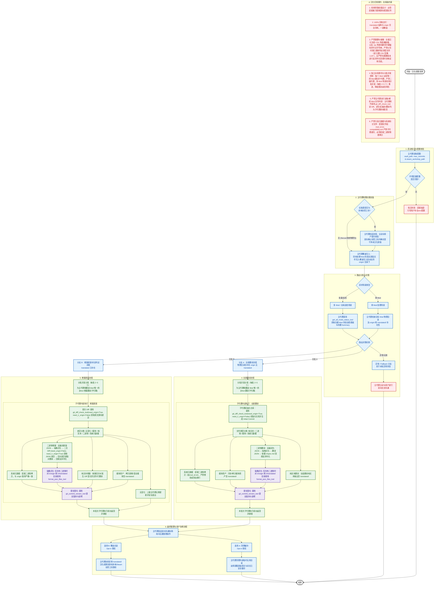

# 模组汉化与增量翻译工作流 (TransPlay-Localization)

本技能指导 Agent 在面对任何游戏模组（Mod）汉化、翻译或更新请求时，如何利用 `transplay-mcp` 服务的底层工具（资源、差异对比、JSON 格式化、Git 版本历史管理、模组全量状态巡检）并结合**独立的 Mod 翻译子代理**及**主代理分批并发指派、人机协同沟通**执行强工程规范的工作流。

---

## 工作流全景图

---

## ⚠️ 汉化红线规约 (防自作聪明/防偷懒)

为确保模组汉化质量，执行本工作流的 Agent 必须无条件遵守以下六条铁律：
1. **拒绝任何旁路挂载设计**：严禁采取任何挂载自定义接口、注入非官方辅助框架或在外部旁路加载字典的汉化方案。必须直接且暴力地替换源码及配置文件中的英文字符串。
2. **交付 100% 同构可覆盖目录**：汉化产物必须输出于 `translated/` 目录下，其文件目录层级结构必须与原始英文 Mod **完全同构**，达到能够直接一键拷贝并覆盖至创意工坊或游戏根目录下即可实装运行的效果。
3. **严禁漏翻与文件偷懒**：必须全量对所有包含文本的媒介进行汉化（包括 CSV 等表格数据、以及 `.lua` 等源码脚本中硬编码的可见字符串）。严禁以任何借口漏掉特定类型文件（如“只翻 CSV 忽略 LUA”），且严禁在漏翻或未进行反序列化回填时自嗨宣称完成。
4. **独立全权委托与分批并发控制**：主代理是与用户双向沟通的唯一实体，子代理严禁直接与用户进行交互。每个 Mod 的翻译任务必须全权合并委派给唯一的一个子代理（Mod 翻译子代理），**严禁在下级再拆分或开设二级子代理**。面对多 Mod 场景时，主代理先统一执行前置铺设（写入 `origin/`），然后采用**分批并发（每批启动 2~5 个子代理）**的方式推进，挂起等待本批全部返回后再进入下一批，在大幅提升整体吞吐量与执行速度的同时，完美规避 LLM 客户端 API 发生 429 限流崩溃的风险。
5. **严禁主代理自行读取/解析 Mod 文件内容**：主代理在汉化推进全流程中，**绝对禁止自行读取、检索或解析任何 Mod 文件的具体内容（包括纯文本、二进制等）**。主代理**绝对禁止**调用会返回具体文件 Diff 内容的 `git_diff_check_tool` 工具，以防大 Mod 的 Diff 文本注入主代理上下文导致 Token 爆炸。主代理仅负责物理文件包的统一拷贝/写入、高层次状态获取与唤醒子代理。仓库的 Git 初始化、具体 Diff 差异分析以及文件读取、反编译与翻译均属于**子代理的排他职责**。
6. **严禁污染元数据与系统标识文件**：对于仅包含系统 ID、别名、版本号、环境依赖或无须汉化的纯配置文件（如 Noita 的 `mod_id.txt`、`compatibility.xml`，或其它游戏的清单 `manifest.json`、`addoninfo.txt` 等），**绝对禁止子代理使用文本流重写**。必须直接使用纯二进制物理拷贝（或直接还原），严防因代码写文件操作在文件尾部引入任何多余的换行符（如 `\n` 或 `\r\n`）、空格或改变其原始字节与编码，避免造成路径映射、依赖检测或游戏引擎加载失效。

---

## 0. 核心架构与目录同构规范

1. **绝对路径隔离**：模组在本地的绝对物理路径映射均由 MCP 服务端隐式计算（基于客户端注入的 `TransPlayVault` 根路径），Agent 仅与 MCP 服务端进行交互，不直接暴露或操作硬编码的绝对物理路径。
2. **目录同构原则**：模组内部的任意子目录及文件结构，在 `origin/`、`translated/`、`ir/origin/` 和 `ir/translated/` 中**必须保持完全一致的目录层级与同构关系**。

---

## 1. 启动探活：获取配置与配置校验

在执行任何具体操作之前，必须首先获取由客户端注入的环境变量参数，确保连接正常：

1. **读取 Resource 资源**：
   - 读取 `transplay://config/vault_path` 获取模组仓库的存放目录。
   - 读取 `transplay://config/max_commits` 获取 Git 历史剪枝的提交上限。
   - 读取 `transplay://config/steam_workshop_path` 获取本地 Steam 创意工坊的存放目录（可选配置，若未注入则返回空字符串，由主代理自主决定是否跳过创意工坊覆盖流程）。
2. **启动异常警示**：
   - 依据环境变量 Fast-fail 设计，若客户端未配置对应的环境变量，MCP 服务端将在模块顶级加载时直接强退。若发生连接 MCP 失败，Agent 应当优先引导并协助用户检查并补全客户端 MCP 配置文件中的 `env` block。

---

## 2. 主代理物理前置准备：新旧源码写入/覆盖（核心前置）

为了能让路由决策机制（特别是 Git 增量差异检测）获得准确的物理判断依据，**主代理在进行 any 状态路由与判定之前，必须优先完成以下前置准备**：

1. **Steam 创意工坊拉取安全校验（强人机确认）**：
   - **防污染硬约束**：若拉取源为本地 Steam 创意工坊目录（即 `steam_workshop_path` 对应的路径，该路径在此前可能已被译文覆盖实装过），**主代理严禁采取任何无脑的自动拉取或拷贝写入操作**。
   - **双向交互校验**：主代理必须**挂起流程，主动向用户发起提问**，显式引导用户核对并确认：当前创意工坊目录下的模组文件确实已被官方更新且**目前为干净、未汉化的原版英文 Mod**。在获得用户在对话中明确的“是/已确认”等肯定授权后，方可执行拷贝写入。非创意工坊源（如直接提供的 Nexus 干净包等）可豁免此交互步骤。
2. **物理覆盖写入**：主代理统一将确认完毕后的待处理模组英文原版文件写入（若为全新翻译）或**覆盖写入**（若为增量更新）到各自 Mod 仓库的 `origin/` 目录下。
3. **目的与意义**：只有先完成这一步，若属于增量更新场景，`origin/` 工作区中才会被制造出新覆盖引起的未提交改动，从而使后续的 Git 差异判定不至于因“未写入”而发生漏检或误判。

---

## 3. 路由分发与状态决策机制

当完成源码的前置写入后，主代理依据具体的场景类型，通过最新的物理及 Git 状态进行路由决策分流：

1. **请求场景判定**：
   - **大批量或全局巡检场景**：主代理优先调用 `get_all_mods_status_tool` 获取整个库下所有 Mod 的状态看板。通过分析输出末尾的 `Check Summary` 提醒行，获知有哪些仅包含 `origin` 目录而遗留待翻的全新模组（Need Translation），或由于新覆盖发生变更的过时模组（Need Update），以此作为调度总看板来筛选和循环分派本批次的翻译任务。
   - **单 Mod 处理场景**：主代理无需调用全量列表扫描，直接通过检查目标 Mod 本地的物理目录及 Git 状态进行精准分流。
2. **分流决策规则 (单 Mod 判定级)**：
   - **分支 A (全新翻译)**：若该 Mod 在物理磁盘上仅存在 `origin/` 但 `translated/` 目录不存在。在主代理下直接派发子代理执行 **[4. 全新翻译流程]**。
   - **分支 B (增量更新流程)**：若该 Mod 的 `translated/` 目录已存在，主代理不自行调用 Git 检测工具（以防大 Diff 注入主代理上下文），而是直接派发子代理执行 **[5. 增量更新流程]**，由子代理在隔离会话中首先获取 Diff 差异并判定是否需要更新。
   - **分支 C (已是最新，无需更新)**：在分支 B 派发的增量子代理内部如果检测到 `origin/` 与当前 HEAD 提交无任何实际差异，子代理将直接向主代理汇报“无变化，已是最新译文”，并正常退出。主代理接收该状态后，在主线程提示用户此 Mod 已经是最新译文，无需重复翻译。
   - **异常 / Fallback 分支**：若处于其他未知异常状态。主代理必须**立即主动与用户进行双向交流沟通**，引导用户核对环境或配置。

---

## 4. 全新翻译流程

1. **主代理分批并发指派子代理**：
   - **主代理严禁调用** `git_diff_check_tool`（防止海量原始文件 Diff 灌入主代理上下文）。主代理在写入原版文件后，直接采用**分批并发（每批并发启动 2~5 个子代理）**的模式推进。
   - 每批次中，主代理为每个 Mod 创建唯一的 **[Mod 翻译子代理]** 并全权指派，**该子代理内部严禁继续向下开辟二级子代理**。
   - 主代理挂起主线程，等待本批次所有子代理返回成功。
2. **子代理内部仓库初始化与文件处理**：
   - **仓库初始化**：被唤醒的子代理首先在其隔离上下文中调用 `git_diff_check_tool(need_origin=True, need_ir_origin=False)`。由于模组仓库此时可能尚未建立 Git 仓库，此调用会由底层工具自动触发 `git init` 并完成 Initial Commit，将首版本固化在仓库底座中。
   - **文件分类与处理**：被唤醒的子代理开始处理具体文件。
3. **子代理执行细节**：
   - **文件分类**：扫描 `origin/`，执行类型分类（无需翻译媒体类、需翻译纯文本、需翻译二进制）。
   - **纯文本翻译**：子代理全盘统筹翻译所有纯文本源文件，直接输出至 `translated/`（严格保持原同构结构）。
   - **二进制翻译**：子代理反编译序列化二进制，建立 `ir/spec.md` 并将 JSON 输出至 `ir/origin/`；调用 `format_json_files_tool` 强格式化 `ir/origin/`；全盘统筹翻译该 JSON 并输出至 `ir/translated/`；最终依据 `ir/spec.md` 反序列化封包生成二进制并回填至 `translated/`。
   - **媒体资产与无需翻译文件**：子代理直接将这些资产同步/拷贝至 `translated/` 对应层级下。
   - **译文强格式化**：若当前 Mod 包含二进制翻译，在反序列化封包生成二进制之前，子代理必须对 `ir/translated/` 目录调用 `format_json_files_tool` 进行强格式化（指定 `sub_dir` 参数为 `"ir/translated"`）。**绝对禁止**对 `translated/` 和 `origin/` 目录调用此工具，以防破坏原生游戏实装文件的字段顺序。若为纯文本 Mod，则无需调用此工具。
   - **提交版本固化**：子代理调用 `git_commit_version_tool` 提交版本与说明（传入 `version` 和 `message` 参数），服务端自动完成 Git commit 并执行 Git 提交历史裁剪。
4. **本批返回与后置处理**：本批次子代理执行完毕后销毁返回，主代理自动拉起下一批，直到所有 Mod 汉化固化完毕，最终由主代理执行 **[6. 最终整理与用户协商流程]**。

---

## 5. 增量更新流程

1. **分批并发指派子代理**：
   - 主代理采用**分批并发（每批并发启动 2~5 个子代理）**的模式推进。
   - 每批次中，主代理为每个 Mod 创建唯一的 **[Mod 增量翻译子代理]** 并全权指派，**内部严禁继续向下开辟二级子代理**。
   - 主代理挂起主线程，等待本批次所有子代理返回成功。
2. **子代理执行细节**：
   - **提取源码差异 (首次 Diff) 与无需更新判断**：
      - 子代理在其隔离上下文中调用 `git_diff_check_tool(need_origin=True, need_ir_origin=False)` 获取增量差异。
      - **无变化退出 (分支 C)**：若检测到无任何实际变化（即 Diff 内容为空），子代理应直接向主代理汇报“该 Mod无变化，已是最新译文”，然后无需进行后续的翻译与提交动作，安全退出并销毁。
      - **有变化继续**：若存在差异，则根据差异对文件进行分类（新增媒体、纯文本、二进制）以进行后续翻译。
   - **纯文本增量**：子代理统筹仅对发生 Diff 变化的文件/行进行针对性增量翻译并写入更新至 `translated/`。
   - **二进制增量**：子代理反编译新版本输出新的序列化 JSON 至 `ir/origin/` 并调用 `format_json_files_tool` 进行强格式化（指定 `sub_dir="ir/origin"`）；调用 `git_diff_check_tool(need_origin=False, need_ir_origin=True)` 获取新旧序列化 JSON 的差异增量；仅针对差异键值对进行全盘翻译并合并写入 `ir/translated/`；最终依据 `ir/spec.md` 反序列化封包回填汉化二进制至 `translated/`。
   - **新增/变化媒体资产**：子代理直接将媒体类文件同步拷贝至 `translated/`。
   - **译文强格式化**：若当前 Mod 包含二进制增量，在反序列化封包生成二进制之前，子代理必须对 `ir/translated` 目录运行 `format_json_files_tool` 进行强格式化（指定 `sub_dir` 参数为 `"ir/translated"`）。**绝对禁止**对 `translated/` 和 `origin/` 目录调用此工具，以防破坏原生游戏实装文件的字段顺序。若为纯文本 Mod 增量，则无需调用此工具。
   - **提交版本固化**：子代理调用 `git_commit_version_tool` 提交版本与说明（传入 `version` 和 `message` 参数），触发服务端自动进行线性历史裁剪。
3. **本批返回与后置处理**：本批次子代理执行完毕后销毁返回，主代理自动拉起下一批，直到所有 Mod 增量固化完毕，最终由主代理执行 **[6. 最终整理与用户协商流程]**。

---

## 6. 最终整理与用户协商流程

完成版本提交固化后，主代理 **绝对不能擅自直接**清理目录或强行覆盖文件，必须遵循以下步骤：

1. **双向沟通协商**：主代理 **必须主动与用户进行沟通**，询问用户需要执行哪些后置整理操作，并提供选择。
2. **在获得用户明确授权意向（Opt-in）后**，执行对应操作：
   - **选择 A (清理缓存)**：清理除了 `TransPlayVault/` 库下以外，在整个翻译流程中在外部生成的临时无用目录（同时友情提醒用户原始英文原件和译文已在仓库 origin and translated 中完整备份，无需担心丢失）。
   - **选择 B (覆盖实装)**：直接协助将 `translated/` 目录下汉化完成的终极成果覆盖写入到用户的游戏 Mod 本地目录或 Steam 创意工坊对应路径下。

---

## 7. 唤醒子代理的 Prompt 约束与二进制处理规约

主代理在唤醒子代理（通过 `invoke_subagent`）时，**必须在 Prompt 中显式声明并包含以下铁律约束**，以确保子代理行为完全符合规范，尤其是对于二进制文件的防呆设计：

1. **隔离与职责定位**：声明 “你是该 Mod 唯一的翻译子代理，对该 Mod 拥有完全且独立的汉化控制权。主代理不会干涉你的具体翻译细节，你必须在自己的隔离会话中完成所有操作。”
2. **无变化主动汇报退出**：声明 “如果你被指派为增量更新任务，在启动后首先调用 `git_diff_check_tool(need_origin=True, need_ir_origin=False)`，如果检测结果为没有变化，请直接回复主代理 ‘无变化，已是最新译文’ 并正常优雅退出，严禁做无意义的重复工作。”
3. **三类文件处理铁律（二进制处理强约束）**：
   - **纯资产/媒体类二进制（如音频库 .bank、图片 .png/..tga、字体等）**：无条件直接同构拷贝至 `translated/` 对应层级，严禁改动任何内容。
   - **可反编译/可解析的逻辑二进制**：必须先将其反编译为中间 JSON 输出到 `ir/origin/`，运行 `format_json_files_tool` 强格式化（按目录传入 `sub_dir`），如果是增量则通过 `need_ir_origin=True` 的 Diff 提取差异键值对，翻译后依据 `ir/spec.md` 重新序列化封包回填至 `translated/`。
   - **源码及纯文本文件（.lua, .xml, .csv, .ini 等）**：直接提取英文硬编码字符串进行汉化翻译，严禁漏翻任何行，翻译后输出至 `translated/` 对应层级下。
4. **100% 同构交付与一键覆盖**：声明 “你交付的所有产物必须完全存放在 `translated/` 下，其内部结构与 `origin/` 必须 100% 同构，保证可一键覆盖实装。”
5. **格式化与版本固化**：声明 “若包含二进制翻译，在反序列化封包前必须对 `ir/translated/` 目录运行 `format_json_files_tool` 进行强格式化（传入 `sub_dir="ir/translated"`），**绝对禁止对 `translated/` 和 `origin/` 目录调用此工具**，以防破坏原生游戏实装文件的字段顺序。在完成所有步骤后，调用 `git_commit_version_tool` 提交版本与说明（传入 `version` 和 `message`），确保版本固化落库。”
