# 模组汉化与增量翻译工作流 (TransPlay-Localization)

本技能指导 Agent 在面对任何游戏模组（Mod）汉化、翻译或更新请求时，如何利用 `transplay-mcp` 服务的底层工具（资源、差异对比、JSON 格式化、Git 版本历史管理）并结合**多级子代理分工**及**人机协同沟通**执行强工程规范的工作流。

---

## 工作流全景图

```mermaid
flowchart TD
    %% 样式定义
    classDef startEnd fill:#f5f5f5,stroke:#333,stroke-width:2px,color:#333;
    classDef mainFlow fill:#e3f2fd,stroke:#1565c0,stroke-width:2px,color:#0d47a1;
    classDef gitTool fill:#ede7f6,stroke:#5e35b1,stroke-width:2px,color:#311b92;
    classDef textStream fill:#e8f5e9,stroke:#2e7d32,stroke-width:2px,color:#1b5e20;
    classDef binStream fill:#fff3e0,stroke:#ef6c00,stroke-width:2px,color:#e65100;
    classDef warnNode fill:#ffebee,stroke:#c62828,stroke-width:2px,color:#b71c1c;

    %% 全局红线规约提示
    subgraph RedLines [⚠️ 汉化红线规约 - 全局强约束]
        RL1["1. 拒绝旁路挂载设计：必须直接暴力替换源码/配置文件"]
        RL2["2. 100百分之 同构交付：translated 结构与 origin 完全同构，一键覆盖"]
        RL3["3. 严禁漏翻与偷懒：全量汉化包括 CSV、LUA 等，严禁漏翻任何文件"]
        RL4["4. 严禁多 Mod 并行与单文件单代理：主代理串行调度多 Mod，父代理合理打包任务"]
    end

    %% 节点定义
    Start(["开始：汉化/更新请求"])
    
    subgraph config_check [1. 启动探活与配置校验]
        ReadConfig["读取配置: vault_path & max_commits"]
        CheckConfig{"环境变量配置<br/>是否完整?"}
        Fail["探活失败：直接强退<br/>引导用户补全env配置"]
    end

    subgraph route_decide [2. 路由分发与决策]
        CheckExist["检查 origin/ 和 translated/<br/>物理目录状态及版本号"]
        DecideRule{"状态决策机制"}
        
        BranchC["分支 C：无需更新<br/>exist_t 存在 且 version_t >= version_o"]
        BranchD["异常 / Fallback 分支<br/>处于未知异常状态"]
        
        PromptC["提示已翻译<br/>告知译文相对路径"]
        InteractD["主动与用户进行<br/>双向交流沟通"]
    end

    Start --> ReadConfig
    ReadConfig --> CheckConfig
    CheckConfig -- 否 --> Fail
    CheckConfig -- 是 --> CheckExist
    CheckExist --> DecideRule

    DecideRule -- 分支 C --> BranchC
    DecideRule -- 异常 --> BranchD
    BranchC --> PromptC
    BranchD --> InteractD
    PromptC --> End(["结束"])
    InteractD --> End
    Fail --> End

    %% 核心分支 A 与 B 的分流
    DecideRule -- 分支 A --> BranchA["分支 A：全新翻译流程<br/>exist_t 不存在"]
    DecideRule -- 分支 B --> BranchB["分支 B：增量更新流程<br/>exist_t 存在 且 version_t < version_o"]

    subgraph branch_a [3. 全新翻译流程]
        WriteO["源码写入: 原始模组写入 origin/"]
        GitInit["仓库初始化: 调用 git_diff_check_tool<br/>need_origin=True, need_ir_origin=False"]
        Classify["文件分类: 扫描并按类型分流"]

        %% 媒体分支
        MediaBranch["无需翻译的媒体类"]
        CopyMedia["主代理直接同步/拷贝至 translated/"]

        %% 文本分支
        TextBranch["需翻译的纯文本源文件"]
        CreateTextAgent["创建一级子代理: 文本翻译"]
        SpawnTextSub["合理打包并分批调用二级子代理: 并行翻译"]
        WriteTextT["翻译输出至 translated/"]

        %% 二进制分支
        BinBranch["需翻译的二进制源文件"]
        CreateBinAgent["创建一级子代理: 二进制解析"]
        Decompile["反编译序列化为 JSON"]
        WriteSpec["建立并写入 ir/spec.md 描述映射"]
        WriteIRO["输出序列化 JSON 至 ir/origin/"]
        FormatIRO["强格式化 ir/origin JSON<br/>调用 format_json_files_tool"]
        SpawnBinSub["合理打包并分批调用二级子代理: 并行翻译 JSON"]
        WriteIRT["翻译输出至 ir/translated/"]
        CompileBin["根据 spec.md 反序列化封包生成二进制"]
        WriteBinT["回填输出至 translated/"]

        FormatAllA["译文强格式化<br/>对 translated & ir/translated 的 JSON 调用 format_json_files_tool"]
        CommitA["提交版本固化: 调用 git_commit_version_tool<br/>服务端自动裁剪 linear 历史"]
    end

    BranchA --> WriteO
    WriteO --> GitInit
    GitInit --> Classify
    
    Classify --> MediaBranch
    MediaBranch --> CopyMedia
    
    Classify --> TextBranch
    TextBranch --> CreateTextAgent
    CreateTextAgent --> SpawnTextSub
    SpawnTextSub --> WriteTextT
    
    Classify --> BinBranch
    BinBranch --> CreateBinAgent
    CreateBinAgent --> Decompile
    Decompile --> WriteSpec
    WriteSpec --> WriteIRO
    WriteIRO --> FormatIRO
    FormatIRO --> SpawnBinSub
    SpawnBinSub --> WriteIRT
    WriteIRT --> CompileBin
    CompileBin --> WriteBinT

    CopyMedia --> FormatAllA
    WriteTextT --> FormatAllA
    WriteBinT --> FormatAllA
    FormatAllA --> CommitA

    subgraph branch_b [4. 增量更新流程]
        WriteO_B["新文件覆盖: 覆盖写入 origin/"]
        DiffB["首次 Diff: 调用 git_diff_check_tool<br/>need_origin=True, need_ir_origin=False"]
        ClassifyB["差异分类: 区分变动/新增文件类型"]

        %% 无变化分支
        NoChangeB["无变化文件"]
        IgnoreB["忽略不作处理"]

        %% 媒体与无需翻译分支 (已补全)
        MediaBranchB["无需翻译但新增/变动的媒体资产"]
        CopyMediaB["主代理直接同构同步/拷贝至 translated/"]

        %% 文本增量
        TextBranchB["需更新的纯文本源文件"]
        CreateTextAgentB["创建一级子代理: 增量文本"]
        SpawnTextSubB["合理打包并分批调用二级子代理: 针对 Diff 变化文件/行翻译"]
        WriteTextT_B["写入更新至 translated/"]

        %% 二进制增量
        BinBranchB["需更新的二进制源文件"]
        CreateBinAgentB["创建一级子代理: 增量二进制"]
        DecompileB["反编译新版本输出 JSON 至 ir/origin/"]
        FormatIRO_B["格式化新版 ir/origin JSON<br/>调用 format_json_files_tool"]
        DiffIR_B["二次 Diff: 调用 git_diff_check_tool<br/>need_origin=False, need_ir_origin=True"]
        SpawnBinSubB["合理打包并分批调用二级子代理: 仅翻译 JSON 增量差异键值对"]
        WriteIRT_B["合并写入至 ir/translated/"]
        CompileBinB["根据 spec.md 反序列化封包生成二进制"]
        WriteBinT_B["回填输出至 translated/"]

        FormatAllB["译文强格式化<br/>对 translated & ir/translated 新生成/修改的 JSON 调用 format_json_files_tool"]
        CommitB["提交版本固化: 调用 git_commit_version_tool"]
    end

    BranchB --> WriteO_B
    WriteO_B --> DiffB
    DiffB --> ClassifyB
    
    ClassifyB --> NoChangeB
    NoChangeB --> IgnoreB
    
    ClassifyB --> MediaBranchB
    MediaBranchB --> CopyMediaB
    
    ClassifyB --> TextBranchB
    TextBranchB --> CreateTextAgentB
    CreateTextAgentB --> SpawnTextSubB
    SpawnTextSubB --> WriteTextT_B
    
    ClassifyB --> BinBranchB
    BinBranchB --> CreateBinAgentB
    CreateBinAgentB --> DecompileB
    DecompileB --> FormatIRO_B
    FormatIRO_B --> DiffIR_B
    DiffIR_B --> SpawnBinSubB
    SpawnBinSubB --> WriteIRT_B
    WriteIRT_B --> CompileBinB
    CompileBinB --> WriteBinT_B

    CopyMediaB --> FormatAllB
    WriteTextT_B --> FormatAllB
    WriteBinT_B --> FormatAllB
    FormatAllB --> CommitB

    subgraph clean_up [5. 最终整理与用户协商流程]
        Consult["双向沟通协商: 询问后置整理操作"]
        OptA["选择 A: 清理缓存<br/>Opt-in 授权"]
        OptB["选择 B: 覆盖实装<br/>Opt-in 授权"]
        CleanCache["清理外部临时无用目录<br/>友情提醒原始英文与译文已安全备份"]
        Deploy["协助复制 translated/ 汉化成果到游戏本地/Steam创意工坊路径"]
    end

    CommitA --> Consult
    CommitB --> Consult
    
    Consult --> OptA
    Consult --> OptB
    
    OptA --> CleanCache
    OptB --> Deploy
    
    CleanCache --> End
    Deploy --> End
    IgnoreB --> End

    %% 显式类样式绑定
    class Start,End startEnd;
    class ReadConfig,CheckConfig,CheckExist,DecideRule,BranchC,PromptC,BranchA,BranchB,WriteO,Classify,MediaBranch,CopyMedia,WriteO_B,ClassifyB,NoChangeB,IgnoreB,MediaBranchB,CopyMediaB,Consult,OptA,OptB,CleanCache,Deploy mainFlow;
    class GitInit,FormatIRO,FormatAllA,CommitA,DiffB,FormatIRO_B,DiffIR_B,FormatAllB,CommitB gitTool;
    class TextBranch,CreateTextAgent,SpawnTextSub,WriteTextT,TextBranchB,CreateTextAgentB,SpawnTextSubB,WriteTextT_B textStream;
    class BinBranch,CreateBinAgent,Decompile,WriteSpec,WriteIRO,SpawnBinSub,WriteIRT,CompileBin,WriteBinT,BinBranchB,CreateBinAgentB,DecompileB,SpawnBinSubB,WriteIRT_B,CompileBinB,WriteBinT_B binStream;
    class Fail,BranchD,InteractD,RL1,RL2,RL3,RL4 warnNode;
```

---

## ⚠️ 汉化红线规约 (防自作聪明/防偷懒)

为确保模组汉化质量，执行本工作流的 Agent 必须无条件遵守以下四条铁律：
1. **拒绝任何旁路挂载设计**：严禁采取任何挂载自定义接口、注入非官方辅助框架或在外部旁路加载字典的汉化方案。必须直接且暴力地替换源码及配置文件中的英文字符串。
2. **交付 100% 同构可覆盖目录**：汉化产物必须输出于 `translated/` 目录下，其文件目录层级结构必须与原始英文 Mod **完全同构**，达到能够直接一键拷贝并覆盖至创意工坊或游戏根目录下即可实装运行的效果。
3. **严禁漏翻与文件偷懒**：必须全量对所有包含文本的媒介进行汉化（包括 CSV 等表格数据、以及 `.lua` 等源码脚本中硬编码的可见字符串）。严禁以任何借口漏掉特定类型文件（如“只翻 CSV 忽略 LUA”），且严禁在漏翻或未进行反序列化回填时自嗨宣称完成。
4. **严禁多 Mod 并行与单文件单代理**：面对多 Mod 汉化请求时，主代理必须采用串行循环的方式依次处理每个 Mod，严禁为 Mod 级别并行化开辟子代理。主代理是与用户双向沟通的唯一实体，子代理严禁直接与用户进行交互。父代理在分派翻译任务时，必须对小文件/JSON 切片进行合理打包（Batching），控制下级并发子代理数量，严禁“一文件一代理”的无节制膨胀。

---

## 0. 核心架构与目录同构规范

1. **绝对路径隔离**：模组在本地的绝对物理路径映射均由 MCP 服务端隐式计算（基于客户端注入 of `TransPlayVault` 根路径），Agent 仅与 MCP 服务端进行交互，不直接暴露或操作硬编码的绝对物理路径。
2. **目录同构原则**：模组内部的任意子目录及文件结构，在 `origin/`、`translated/`、`ir/origin/` 和 `ir/translated/` 中**必须保持完全一致的目录层级与同构关系**。

---

## 1. 启动探活：获取配置与配置校验

在执行任何具体翻译操作之前，必须首先获取由客户端注入的环境变量参数：

1. **读取 Resource 资源**：
   - 读取 `transplay://config/vault_path` 获取模组仓库的存放目录。
   - 读取 `transplay://config/max_commits` 获取 Git 历史剪枝的提交上限。
2. **启动异常警示**：
   - 依据环境变量 Fast-fail 设计，若客户端未配置对应的环境变量，MCP 服务端将在模块顶级加载时直接强退。若发生连接 MCP 失败，Agent 应当优先引导并协助用户检查并补全客户端 MCP 配置文件中的 `env` block。

---

## 2. 路由分发：状态决策机制

当接收到汉化或更新请求（涉及特定 `<game_id>` 和 `<mod_id>`）时，检查对应模组的物理目录状态：

1. **状态决策分支**：
   - 检查 `origin/` 是否存在 (记为 `exist_o`)，及原版版本号 `version_o`。
   - 检查 `translated/` 是否存在 (记为 `exist_t`)，及译文版本号 `version_t`。
2. **路由决策规则**：
   - **分支 A (全新翻译)**：若 `exist_t` 不存在。执行 **[3. 全新翻译流程]**。
   - **分支 B (增量更新)**：若 `exist_t` 存在，且 `version_t < version_o`。执行 **[4. 增量更新流程]**。
   - **分支 C (无需更新)**：若 `exist_t` 存在，且 `version_t >= version_o`。直接提示用户此 Mod 已经翻译过，并告知译文所在的相对查看路径。
   - **异常 / Fallback 分支**：若处于其他未知异常状态，Agent 必须**立即主动与用户进行双向交流沟通**，引导用户核对模组状态或环境配置。

---

## 3. 全新翻译流程

1. **源码写入**：将原始模组的所有文件写入 `origin/` 目录中。
2. **仓库初始化**：在做任何修改或分类前，先调用一次 `git_diff_check_tool(need_origin=True, need_ir_origin=False)` 触发底层 Git 仓库自动完成 `init` 并创建 Initial Commit。
3. **文件分类环节**：扫描 `origin/`，执行文件类型分类：
   - **无需翻译的媒体类**（音频、图片、视频等）。
   - **需翻译的纯文本源文件**。
   - **需翻译的二进制源文件**。
4. **多级并行代理翻译**：
   - **纯文本源文件**：
     - 创建 **[一级子代理 (文本翻译)]** 指派纯文本汉化任务。
     - 一级子代理调用**批量的二级子代理**，并行翻译并输出至 `translated/`（严格保持原目录结构）。
   - **二进制源文件**：
     - 创建 **[一级子代理 (二进制解析)]** 指派二进制汉化任务。
     - 一级子代理自行设计 JSON 序列化方案，建立 `ir/spec.md` 描述映射，并将反编译序列化的 JSON 输出到 `ir/origin/`。
     - **确定性强格式化**：调用 `format_json_files_tool` 对 `ir/origin` 的所有 JSON 进行 Key 字典序强排序与 2 空格缩进格式化，防止产生 Git 格式噪点。
     - 一级子代理启动**并行二级子代理**，翻译 `ir/origin` 的 JSON 输出到 `ir/translated/`。
     - 一级子代理读取 `ir/translated/`，依据 `ir/spec.md` 反序列化打包生成汉化二进制，回填输出到 `translated/`。
   - **无需翻译的文件**：
     - 主代理负责将这些资产直接拷贝/同步至 `translated/` 对应层级下。
5. **译文强格式化**：在提交固化前，对 `translated/` 和 `ir/translated/` 下生成的所有 JSON 文件调用 `format_json_files_tool` 强格式化。
6. **提交版本固化**：调用 `git_commit_version_tool` 提交版本（包含版本号及 commit 说明）。服务端会自动完成 Git commit 并自动执行 Git 提交历史裁剪（保留最后 `max_commits` 个历史）。
7. **后置操作整理**：执行 **[5. 最终整理与用户协商流程]**。

---

## 4. 增量更新流程

1. **新文件覆盖**：将新版本的原始模组文件覆盖写入 `origin/` 目录。
2. **提取源码差异 (首次 Diff)**：
   - 调用 `git_diff_check_tool(need_origin=True, need_ir_origin=False)` 获取原版新旧文件的增量差异。
   - 依据差异内容进行分类：无变化文件 / 需更新纯文本 / 需更新二进制。
3. **针对性增量更新翻译**：
   - **纯文本源文件**：
     - 创建 **[一级子代理 (增量文本)]**。
     - 调动二级子代理仅对发生 Diff 变化的文件/行进行针对性增量翻译并写入更新至 `translated/`。
   - **二进制源文件**：
     - 创建 **[一级子代理 (增量二进制)]**。
     - 反编译新版本输出新的序列化 JSON 至 `ir/origin/` 并调用 `format_json_files_tool` 进行强格式化。
     - **提取 IR 差异 (二次 Diff)**：调用 `git_diff_check_tool(need_origin=False, need_ir_origin=True)` 获取新旧序列化 JSON 的差异增量。
     - 调动二级子代理仅针对 IR JSON 的增量差异键值对进行翻译，合并写入 `ir/translated/`。
     - 读取 `ir/translated/` 并依据 `spec.md` 反序列化封包输出最新汉化二进制至 `translated/`。
4. **译文强格式化**：对 `translated/` 和 `ir/translated/` 下新生成或修改过的 JSON 文件运行 `format_json_files_tool`。
5. **提交版本固化**：调用 `git_commit_version_tool` 提交版本，触发服务端自动进行 linear 历史裁剪。
6. **后置操作整理**：执行 **[5. 最终整理与用户协商流程]**。

---

## 5. 最终整理与用户协商流程

完成版本提交固化后，Agent **绝对不能擅自直接**清理目录或强行覆盖文件，必须遵循以下步骤：

1. **双向沟通协商**：Agent **必须主动与用户进行沟通**，询问用户需要执行哪些后置整理操作，并提供选择。
2. **在获得用户明确授权意向（Opt-in）后**，执行对应操作：
   - **选择 A (清理缓存)**：清理除了 `TransPlayVault/` 库下以外，在整个翻译流程中在外部生成的临时无用目录（同时友情提醒用户原始英文原件和译文已在仓库 origin 和 translated 中完整备份，无需担心丢失）。
   - **选择 B (覆盖实装)**：直接协助将 `translated/` 目录下汉化完成的终极成果覆盖写入到用户的游戏 Mod 本地目录或 Steam 创意工坊对应路径下。
